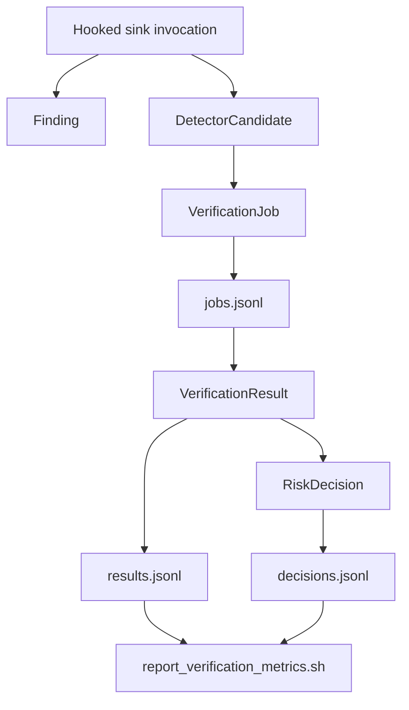
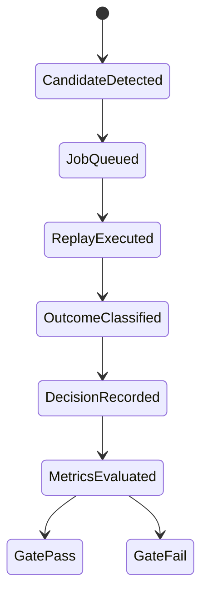

# Artifact and Decision Lifecycle

```mermaid
flowchart TD
    A[Hooked sink invocation] --> B[Finding]
    A --> C[DetectorCandidate]

    C --> D[VerificationJob]
    D --> E[jobs.jsonl]

    E --> G[VerificationResult]
    G --> I[results.jsonl]
    G --> J[RiskDecision]
    J --> K[decisions.jsonl]

    I --> O[report_verification_metrics.sh]
    K --> O
```

```mermaid
stateDiagram-v2
    [*] --> CandidateDetected
    CandidateDetected --> JobQueued
    JobQueued --> ReplayExecuted
    ReplayExecuted --> OutcomeClassified
    OutcomeClassified --> DecisionRecorded
    DecisionRecorded --> MetricsEvaluated
    MetricsEvaluated --> GatePass
    MetricsEvaluated --> GateFail
```

## Notes

- Worker path includes explicit `results.jsonl` + scoring to `decisions.jsonl`.
- Metrics/gates consume the worker decision stream.
